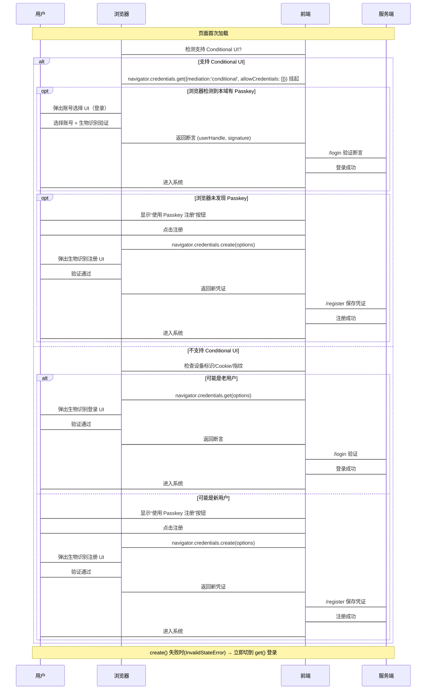

```mermaid
sequenceDiagram
    participant 用户
    participant 浏览器
    participant 前端
    participant 服务端

    Note over 用户,服务端: 页面首次加载

    前端->浏览器: 检测支持 Conditional UI?
    alt 支持 Conditional UI
        前端->浏览器: navigator.credentials.get({mediation:'conditional', allowCredentials: []}) 挂起
        opt 浏览器检测到本域有 Passkey
            浏览器->用户: 弹出账号选择 UI（登录）
            用户->浏览器: 选择账号 + 生物识别验证
            浏览器->前端: 返回断言 (userHandle, signature)
            前端->服务端: /login 验证断言
            服务端->前端: 登录成功
            前端->用户: 进入系统
        end
        opt 浏览器未发现 Passkey
            前端->用户: 显示“使用 Passkey 注册”按钮
            用户->前端: 点击注册
            前端->浏览器: navigator.credentials.create(options)
            浏览器->用户: 弹出生物识别注册 UI
            用户->浏览器: 验证通过
            浏览器->前端: 返回新凭证
            前端->服务端: /register 保存凭证
            服务端->前端: 注册成功
            前端->用户: 进入系统
        end
    else 不支持 Conditional UI
        前端->浏览器: 检查设备标识/Cookie/指纹
        alt 可能是老用户
            前端->浏览器: navigator.credentials.get(options)
            浏览器->用户: 弹出生物识别登录 UI
            用户->浏览器: 验证通过
            浏览器->前端: 返回断言
            前端->服务端: /login 验证
            服务端->前端: 登录成功
            前端->用户: 进入系统
        else 可能是新用户
            前端->用户: 显示“使用 Passkey 注册”按钮
            用户->前端: 点击注册
            前端->浏览器: navigator.credentials.create(options)
            浏览器->用户: 弹出生物识别注册 UI
            用户->浏览器: 验证通过
            浏览器->前端: 返回新凭证
            前端->服务端: /register 保存凭证
            服务端->前端: 注册成功
            前端->用户: 进入系统
        end
    end

    Note over 用户,服务端: create() 失败时(InvalidStateError) → 立即切到 get() 登录
```